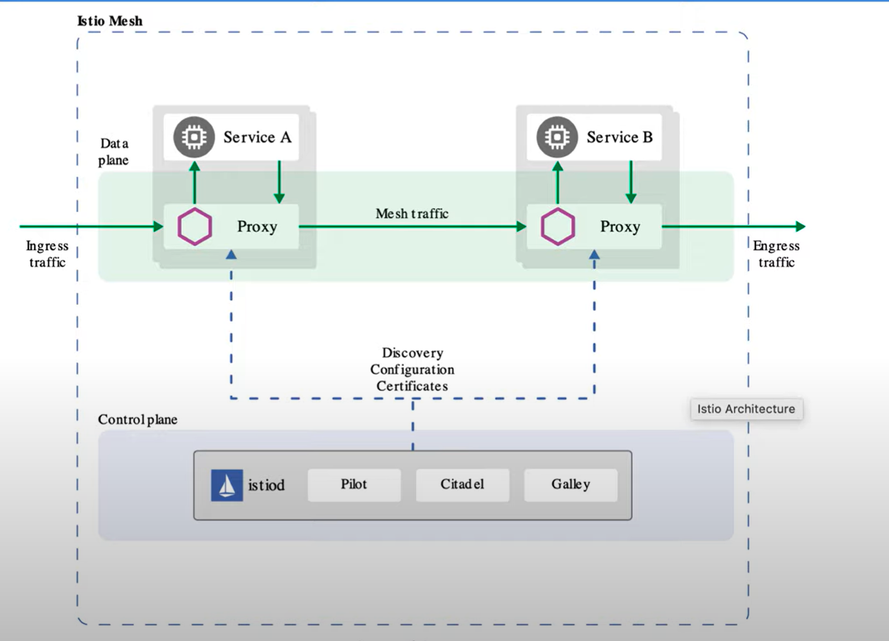

# AWS EKS CLUSTER
---
## **Step 1: Create a EKS cluster**
- Connect to the cluster
```bash
#LOGIN TO AWS WITH CLI
aws configure
#VERIFY
aws sts get-caller-identity
#UPDATES .KUBE/CONFIG FILE
aws eks update-kubeconfig --region <your-region> --name <your-cluster-name>
```
## **Step 2: Install istio **
```bash
curl -L https://istio.io/downloadIstio | sh -
#PreCheck if it is the right source and hashes match
cd istio-1.24.2
export PATH=$PWD/bin:$PATH
istioctl x precheck
istioctl manifest apply --set profile=demo
#Verify
kubectl get pods -n istio-system
```
## **Step 3: Create a namespace and add labels for istio**
```bash
kubectl create namespace production
kubectl describe ns production
kubectl label namespace production istio-injection=enabled
```
## **Step 4: Deploy an app and see if istio injection works**
```bash
kubectl apply -f deployment.yaml
kubectl apply -f deployment.yaml -n production
# See how sidecar containers are deployed only on production namespace where we have labeled istio-injection=enabled
kubetle delete -f deployment.yaml
kubectl delete -f deployment.yaml -n production
# delete it if you want, this is just for testing
```
## **ISTIO ARCHITECTURE**
## **Step 5: Deploy two applications and services** 
```bash
kubectl create -f istiosvc.yaml -n production #testing 
kubectl create -f virtualservice.yaml -n production #testing
#Actual arch with three micro services.
kubectl create -f booksElectronicsVsDr.yaml
kubectl create -f booksElectronics.yaml
```
## **Step 6: Modify DNS and Check Service**
```bash
kubectl get svc -n kube-system
sudo cp /etc/resolv.conf /etc/resolv.conf.bkp
sudo vi /etc/resolv.conf
nameserver 10.96.0.10 #ip address of service that handles the dns pods
nameserver 127.0.0.53
options edns0 trust-ad
search production.svc.cluster.local svc.cluster.local cluster.local eu-west-2.compute.internal

#Check service now
curl http://retail-svc.production.svc.cluster.local:8000
This container is for "RETAIL"
```
## **Step 7: Create Gateway object**
```bash
kubectl get svc -n istio-system | grep ingress
#Note the port number used 31400 in my case
# $ kubectl get svc -n istio-system | grep ingress
# istio-ingressgateway   LoadBalancer   10.100.99.160    k8s-istiosys-istioing-6fbf4fee8b-2aed167d3bec5029.elb.eu-west-2.amazonaws.com   15021:30982/TCP,80:32182/TCP,443:32575/TCP,31400:32591/TCP,15443:32213/TCP
kubectl create -f kiali-gateway.yaml
kubectl create -f kialiVSDR.yaml
kubectl create -f prometheus-gateway.yaml
kubectl create -f prometheusVSDR.yaml
```
## **Access the service**