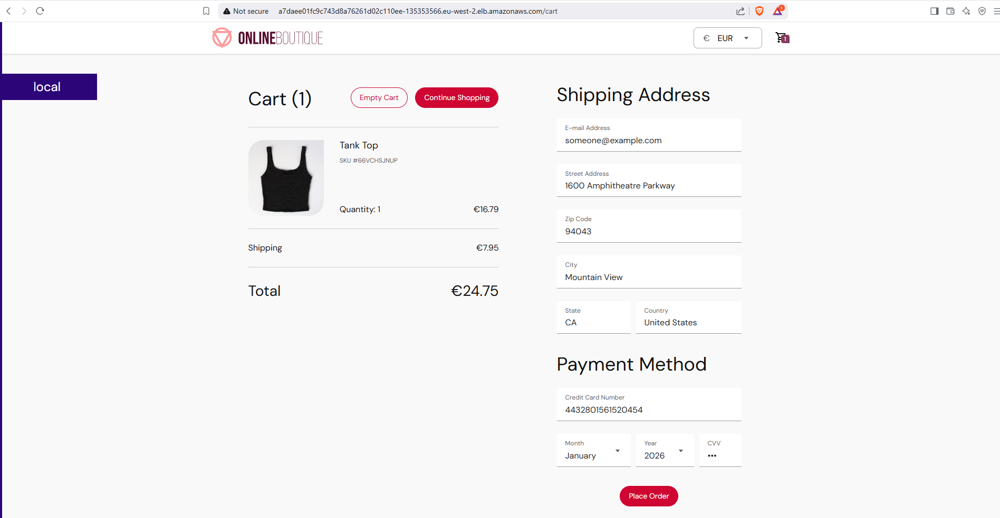

# AWS EKS Infrastructure using terraform

## **Step 1: Host the infrastructure**
```terraform
terraform init
terraform fmt
terraform plan --out=tfplan
terraform apply tfplan
```

## **Step 2: Update the cluster to your current context in kubernetes ./kube/config**
```bash
aws eks update-kubeconfig --region $REGION --name $CLUSTERNAME
```

## **Step 3: Install istio components in the cluster**
- <a href="https://istio.io/latest/docs/setup/getting-started/">Istio Installation guide </a>
```bash
istioctl install --set profile=demo -y
#After installation
kubectl config set-context --current --namespace=istio-system
kubectl get pods
```
- Ingress gateway manages incoming traffic.
- Egress gateway manages outgoing traffic.
-  Istio Architecture </img>

## **Step 4: Deploy the application**
```bash
kubectl create namespace production
kubectl label namespace production istio-injection=enabled
kubectl describe namespace production
kubectl apply -f application.yaml -n production
kubectl config set-context --current --namespace=production
kubectl get pods
kubectl get service 
```

## **Step 5: Configure security group on EKS cluster to allow Incoming traffic on port 80 and 443**

## **Step 6: Create Gateways and Virtual Service**
```bash
kubectl create -f kialivs.yaml
```
- access the kiali UI at istio-ingressgateway-elb/kiali
- access the grafana UI at istio-ingressgateway-elb/grafana
- To the grafana.yaml, add these lines to the config map so that it allows access to application from reverse proxy.
- From this
```bash
[server]
    domain = ''
```
- To this 
```bash 
[server]
    domain = ''
    root_url = %(protocol)s://%(domain)s/grafana/
    serve_from_sub_path = true
```
- access the prometheus UI at istio-ingressgateway-elb/prometheus

## **Step 7: CleanUp**
```terraform
terraform destroy auto-approve
```

### **IMAGES**
**Application Products UI** 

**Application Selected Item UI** 

**Application Payment Page UI** 

**Application Payment Confirmation Page UI** 

**Kiali Dashboard** 

**Istio Mesh** 

**Prometheus metrics Grafana Dashboard UI** 

